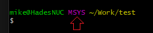
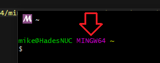

# MinGW64 setup (both 32bit and 64bit Windows binaries)
Visit https://www.msys2.org/ and Install Msys2.

**IMPORTANT**: MSYS uses different startup shells to build 32bit and 64bit binaries. The default is the MSYS environment's own compiler.



When setting up MSYS, you will be in MSYS mode, as shown above. This mode should only be used for setup. You can check the `MSYSTEM` environment variable to know what mode you're in.

```bash
echo $MSYSTEM
```

## Getting started with MSYS2
Msys2 uses `pacman` for installing packages.

```bash
# Reference
pacman -Su                           # update installed packages. You should do this after installation!
pacman -S package-name               # install a package (the S means Sync)
pacman -Ss keyword                   # search for a package by keyword
pacman -S package-name --noconfirm   # don't confirm
```

You should do the following on a fresh install.

```bash
ln -s /c/Work            # from your home folder
pacman -Su
pacman -S git make nano
pacman -S mingw32/mingw-w64-i686-git-lfs
pacman -S mingw64/mingw-w64-x86_64-git-lfs
```

If you come from Ubuntu, you're going to find some shorthands you rely on like `ll` are unavailable, and `ls` lacks any color.

You can enable these by editing `.bashrc` in your home directory.

```bash
nano .bashrc
```

Search for the `# Aliases` section. Most of the items there are what you're expecting.

Save and restart the shell for the changes to take effect.

## Installing development packages
Below you'll find a list of development packages you're going to want to install. 

[This gist](https://gist.github.com/thales17/fb2e4cff60890a51d9dddd4c6e832ad2) can be used to confirm that you have setup your environment correctly.

**IMPORTANT**: If you're trying to build the test program statically (`--static` or by wrapping the `--static-libs` output from sdl2-config with `-Wl,-Bstatic` and `-Wl,-Bdynamic`), you're going to get a bunch of errors. These are due to missing symbols. Dropping the missing symbols in to Google should bring up the MSDN pages where they mention the associated libraries.

```bash
gcc -o hello -Wall hello.c `sdl2-config --cflags --libs`
gcc -o hello-static -Wall hello.c `sdl2-config --cflags --static-libs` --static -lwinmm -limm32 -lole32 -lversion -loleaut32 -lsetupapi
```

### Installing 64bit Windows development packages
The 64bit toolchain packages are named x86_64.

```bash
pacman -S mingw-w64-x86_64-toolchain 
pacman -S mingw64/mingw-w64-x86_64-SDL2 mingw64/mingw-w64-x86_64-SDL2_mixer mingw64/mingw-w64-x86_64-SDL2_image 
pacman -S mingw64/mingw-w64-x86_64-glew
pacman -S mingw-w64-x86_64-vulkan-devel
pacman -S mingw64/mingw-w64-x86_64-zlib mingw64/mingw-w64-x86_64-xz # zlib, lzma
pacman -S mingw64/mingw-w64-x86_64-clang
```

### Installing 32bit Windows development packages
The 32bit toolchain packages are name i686.

```bash
pacman -S mingw-w64-i686-toolchain 
pacman -S mingw32/mingw-w64-i686-SDL2 mingw32/mingw-w64-i686-SDL2_mixer mingw32/mingw-w64-i686-SDL2_image 
pacman -S mingw32/mingw-w64-i686-glew
pacman -S mingw-w64-i686-vulkan-devel
pacman -S mingw32/mingw-w64-i686-zlib mingw32/mingw-w64-i686-xz # zlib, lzma
pacman -S mingw32/mingw-w64-i686-clang
```

## Building for 32bit or 64bit Windows
Close the `MSYS` shell, and open either a `MSYS2 MinGW 64-bit` or `MSYS2 MinGW 32-bit` shell instead. These should have been added to your **Start** menu by the Msys installer.

The current mode your shell is in is shown in the purple text.



Alternatively, you can check the `MSYSTEM` envirnoment variable.

```bash
echo $MSYSTEM
```

Once you have the correct shell, simply run `make`.
